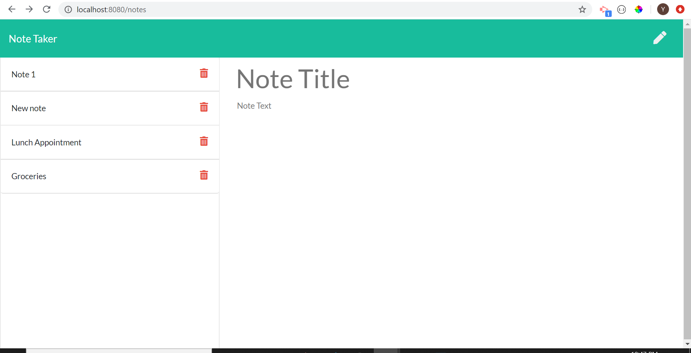

# note-taker

## Table of Contents
<!--ts-->
   * [Project Description](#project-description)
   * [Technologies Used](#technologies-used) 
   * [Dependencies](#dependencies)
   * [Tests](#tests)
   * [Using Repo](#using-repo)
   * [Contributing to the repo](#contributing-to-the-repo)
   * [Licenses](#licenses)
   * [Inquiries](#inquiries)
   * [Developer Info](#developer-info)
<!--te-->
## Project Description
A note taking application that can be used to write, save, and delete notes. This application uses an express backend to save and retrieve note data from a JSON file

Project url: 
(https://github.com/wayele/note-taker)

## Screenshots
User is able to add, save, and delete using application 

## Technologies Used
HTML, CSS, JavaScript, Node JS, npmpackages, express

## Dependencies
npm install
## Tests
no tests
## Using Repo
install all dependencies and use as needed
## Contributing to the repo
contribution to improve functionality of application are always welcome
## Licenses

MIT
## Inquiries
Yes

ayele.wub@gamil.com
## Developer Info:

Github username: wayele

Email: ayele.wub@gamil.com
